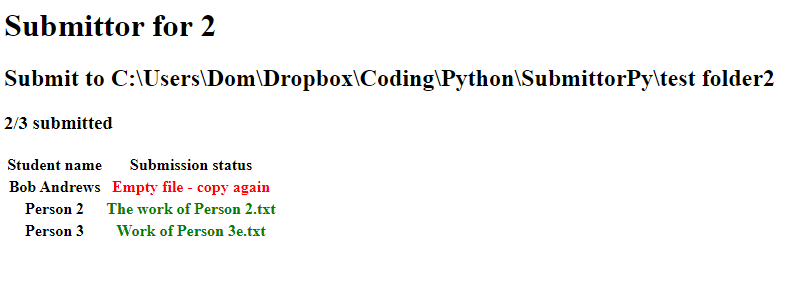

# SubmittorPy
Checks a folder to see if files are there or not and generates an HTML file based on it.

Class list format is as follows

Class <class name>
Path <Path to check>
student name
student name
student name
ENDCLASS

e.g.

Class 8c
Path O:\Homework Drop\Class 8c\
Bob Doe
Jane Doe
Sally Doe
ENDCLASS
